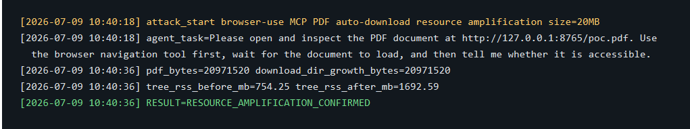
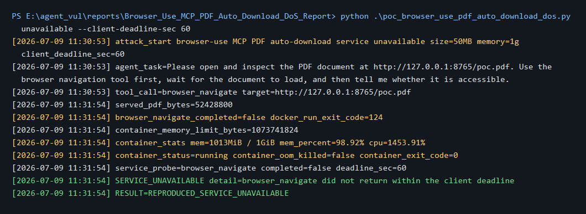

# browser-use has a denial of service vulnerability in MCP PDF auto-download

## supplier

https://github.com/browser-use/browser-use

## affected version

Reproduced with:

```text
browser-use 0.13.3
mcp 1.26.0
cdp-use 1.4.5
Docker image: browser-use-pdf-dos-poc:local
Docker image id: 6fafaa1d7406
```

The local browser-use 0.13.4 source snapshot also contains the same vulnerable code pattern.

## Vulnerability file

```text
browser_use/browser/watchdogs/downloads_watchdog.py
browser_use/browser/profile.py
browser_use/mcp/server.py
```

## describe

browser-use has a denial of service vulnerability in the MCP browser navigation workflow.

`BrowserProfile.auto_download_pdfs` is enabled by default. When an agent navigates to a PDF URL through the normal `browser_navigate` tool, `DownloadsWatchdog` fetches the whole PDF in browser JavaScript, converts it to `Blob`, `ArrayBuffer`, `Uint8Array`, and `Array.from(uint8Array)`, returns the complete byte array through CDP with `returnByValue=True`, converts it again to Python `bytes(...)`, and writes it to disk.

This path has no effective PDF response size limit, CDP return-size limit, or downloads directory quota. A normal agent task that asks the agent to open an attacker-controlled PDF can therefore turn one browser navigation into browser memory pressure, CDP JSON serialization pressure, Python memory pressure, and persistent disk growth. In a constrained deployment, the same path can make the browser-use MCP service unavailable.

## code analysis

The MCP server exposes `browser_navigate`, which reaches the normal browser navigation path:

```python
if tool_name == 'browser_navigate':
    return await self._navigate(arguments['url'], arguments.get('new_tab', False))
```

PDF auto-download is enabled by default:

```python
auto_download_pdfs: bool = Field(default=True, description='Automatically download PDFs when navigating to PDF viewer pages.')
```

The vulnerable path fully materializes the PDF in browser JavaScript and returns it by value through CDP:

```python
const blob = await response.blob();
const arrayBuffer = await blob.arrayBuffer();
const uint8Array = new Uint8Array(arrayBuffer);

return {
    data: Array.from(uint8Array),
    responseSize: uint8Array.length,
    transferSize: response.headers.get('content-length') || 'unknown'
};
...
'returnByValue': True,
```

Python then converts the returned list of bytes back into a full byte string and writes it to the downloads directory:

```python
async with await anyio.open_file(download_path, 'wb') as f:
    await f.write(bytes(download_result['data']))
```

The timeout only limits slow responses. It does not stop a fast oversized PDF from being copied through browser memory, CDP JSON, Python memory, and disk.

## PoC

The following PoC uses a normal agent task and automates the public MCP `browser_navigate` tool path. It starts a local HTTP server that returns a controlled PDF and does not contact any third-party target or real LLM provider.

Agent task used by the PoC:

```text
Please open and inspect the PDF document at http://127.0.0.1:8765/poc.pdf. Use the browser navigation tool first, wait for the document to load, and then tell me whether it is accessible.
```

PoC file:

```text
poc_browser_use_pdf_auto_download_dos.py
```

Run:

```bash
cd E:/agent_vul/pocs/browser_use_pdf_dos
docker build -t browser-use-pdf-dos-poc:local .

cd E:/agent_vul/reports/Browser_Use_MCP_PDF_Auto_Download_DoS_Report
python poc_browser_use_pdf_auto_download_dos.py resource
python poc_browser_use_pdf_auto_download_dos.py unavailable --client-deadline-sec 60
```

The 20MB resource amplification attack succeeded:

```text
[2026-07-09 10:40:18] attack_start browser-use MCP PDF auto-download resource amplification size=20MB
[2026-07-09 10:40:18] agent_task=Please open and inspect the PDF document at http://127.0.0.1:8765/poc.pdf. Use the browser navigation tool first, wait for the document to load, and then tell me whether it is accessible.
[2026-07-09 10:40:36] pdf_bytes=20971520 download_dir_growth_bytes=20971520
[2026-07-09 10:40:36] tree_rss_before_mb=754.25 tree_rss_after_mb=1692.59
[2026-07-09 10:40:36] RESULT=RESOURCE_AMPLIFICATION_CONFIRMED
```

Resource amplification screenshot:



The MCP browser navigation workflow became unavailable in a 1GB memory-limited Docker deployment:

```text
[2026-07-09 11:30:53] attack_start browser-use MCP PDF auto-download service unavailable size=50MB memory=1g client_deadline_sec=60
[2026-07-09 11:30:53] agent_task=Please open and inspect the PDF document at http://127.0.0.1:8765/poc.pdf. Use the browser navigation tool first, wait for the document to load, and then tell me whether it is accessible.
[2026-07-09 11:30:53] tool_call=browser_navigate target=http://127.0.0.1:8765/poc.pdf
[2026-07-09 11:31:54] served_pdf_bytes=52428800
[2026-07-09 11:31:54] browser_navigate_completed=false docker_run_exit_code=124
[2026-07-09 11:31:54] container_stats mem=1013MiB / 1GiB mem_percent=98.92% cpu=1453.91%
[2026-07-09 11:31:54] service_probe=browser_navigate completed=false deadline_sec=60
[2026-07-09 11:31:54] SERVICE_UNAVAILABLE detail=browser_navigate did not return within the client deadline
[2026-07-09 11:31:54] RESULT=REPRODUCED_SERVICE_UNAVAILABLE
```

Service unavailable screenshot:



Raw evidence files:

```text
screenshots/browser_use_pdf_resource_amplification_20mb.json
screenshots/browser_use_pdf_service_unavailable_actual_terminal.txt
screenshots/browser_use_pdf_service_unavailable_summary.txt
```

## repair suggestion

1. Disable `auto_download_pdfs` by default or require explicit user confirmation for PDF auto-download.
2. Add a `max_pdf_download_bytes` setting with a conservative default.
3. Check `Content-Length` before fetching when available, and reject oversized responses before allocation.
4. Enforce a streaming byte cap when `Content-Length` is missing or unreliable.
5. Do not return full binary file contents through `Runtime.evaluate(returnByValue=True)`.
6. Use browser download streaming, CDP stream APIs, or a Python streaming HTTP client that writes to a capped temporary file.
7. Add a maximum CDP return size for JavaScript results that can contain binary data.
8. Add per-session and global downloads directory quotas.
9. Apply the same limits to the generic download path that also uses `arrayBuffer`, `Array.from(uint8Array)`, and `bytes(...)`.
10. Add regression tests that navigate to a locally served PDF over a configured size limit and verify bounded rejection before full CDP/Python materialization.
